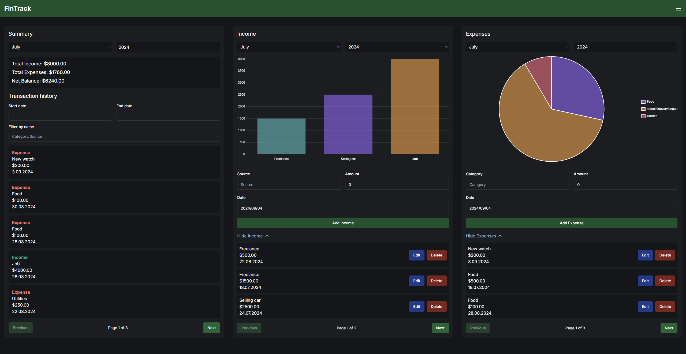
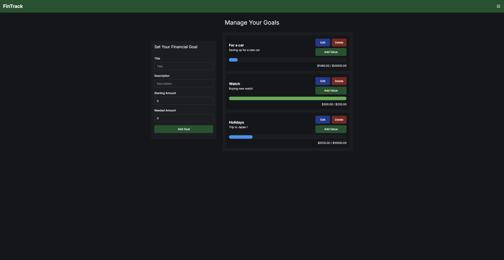

# Personal Finance Management Dashboard

## Description

The Personal Finance Management Dashboard is a web application designed to help users track their expenses, incomes, and financial goals. It provides visual insights through charts and graphs, allowing users to make informed financial decisions.

## Features

- **User Authentication**

  - Sign up, log in, and log out functionality.
  - Secure user authentication using Firebase Authentication.

- **Dashboard Overview**

  - Display a summary of total income, total expenses, and net balance.
  - Visual insights using Chart.js (e.g., pie charts for expense categories, bar charts for income sources).

- **Expense & Income Tracking**

  - Add, edit, and delete expenses and incomes.
  - Categorize transactions (e.g., food, rent, salary, freelance).
  - Display transaction history with filters for date ranges and categories.

- **Budgeting & Goals**

  - Set monthly/annual budgets and track progress.
  - Create and monitor financial goals (e.g., saving for a vacation).

- **Responsive Design**

  - Fully responsive design ensuring the application works on various devices.

## Screenshots

Here are some screenshots of the Personal Finance Management Dashboard:

_Sign In Overview_


_Dashboard Overview_


_Goal Tracking_

## Technologies Used

- **React**: For building the user interface.
- **Next.js**: For server-side rendering, API routes, and optimized performance.
- **Tailwind CSS**: For styling the application with a utility-first approach.
- **Chart.js**: For creating interactive charts and graphs.
- **Firebase**: For authentication, real-time database, and storage.
- **Redux**: For state management.
- **TypeScript**: For type safety and better code quality.
- **Jest & React Testing Library**: For testing components.
- **Shadcn**: For form handling and validation.

## License

This project is licensed under the MIT License - see the [LICENSE](LICENSE) file for details.

## Installation

Follow these steps to set up the project locally on your machine.

**Prerequisites**

Make sure you have the following installed on your machine:

- [Git](https://git-scm.com/)
- [Node.js](https://nodejs.org/en)
- [npm](https://www.npmjs.com/) (Node Package Manager)

**Cloning the Repository**

```bash
git clone https://github.com/JakubGasiorek/personal-finance-dashboard.git
cd personal-finance-dashboard
```

**Installation**

Install the project dependencies using npm:

```bash
npm install
```

**Set Up Environment Variables**

Create a new file named `.env.local` in the root of your project and add the following content:

```env
#Firebase
NEXT_PUBLIC_FIREBASE_API_KEY=your-api-key
NEXT_PUBLIC_FIREBASE_AUTH_DOMAIN=your-auth-domain
NEXT_PUBLIC_FIREBASE_PROJECT_ID=your-project-id
NEXT_PUBLIC_FIREBASE_STORAGE_BUCKET=your-storage-bucket
NEXT_PUBLIC_FIREBASE_MESSAGING_SENDER_ID=your-messaging-sender-id
NEXT_PUBLIC_FIREBASE_APP_ID=your-app-id
```

Replace the placeholders with your actual Firebase project configuration details. Keep this file private and do not commit it to version control.

**Running the Project**

```bash
npm run dev
```

Open [http://localhost:3000](http://localhost:3000) in your browser to view the project.
